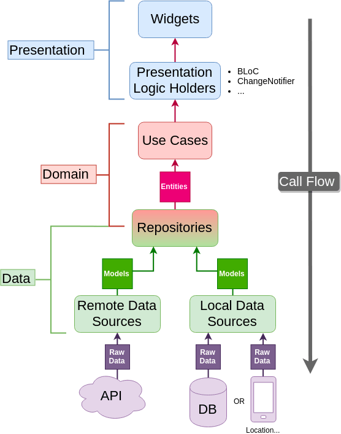

# Template
Flutter Basic Template Application

**Architecture Design**

**Environments**
Configuration will be done based on below respective file(environment)
- [Dev](lib/config/env/dev.dart)
- [Prod](lib/config/env//prod.dart)
- [QA](lib/config/env//qa.dart)
- [UAT](lib/config/env//uat.dart)

**Folder Structure**

**Libraries**
- 	State management
  	- 	get
- 	Route Management/Routing
  	- 	get
- 	Localization & Internationalization
  	- 	flutter_localization
  	- 	intl
- 	Dependency Injection
  	- 	get
- 	Networking
  	- 	dio
  	- 	retrofit
- 	Local Storage
  	- 	sqflite
  	- 	floor & floor_annotation
  	- 	shared_preferences
- 	Network Images Loading
  	- 	cached_image_network
- 	Code Analysis
  	- 	lint

